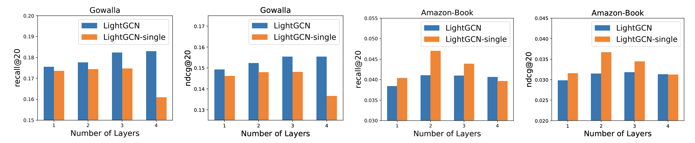

# Gitner
Tinder but for issues.
Love from **Vik**, **Yida** and **Shadow**

# Matching/Recommendation Backend
For license and commercial issues please contact [Yida](https://wangyida.github.io/)
We aim at building a more concise and appropriate recommendation backend using *graph convolution network*. Specifically, [LightGCN](https://github.com/kuandeng/LightGCN) is adopted as the matching algorithm, which learns user and item embeddings and potential relationships. Furthermore, we refer to a [parallelized version](https://github.com/Wuyxin/LightGCN-parallelized-version) upon LightGCN to imrpove the inference speed. We are appreciate for original authors of such paper.

## Numerical Performance
We report the performance which are claimed in paper of [LightGCN](https://arxiv.org/pdf/2002.02126.pdf), where benchmarks are reported in 4 publically available datasets. Such quantitative results satisfy our need for building the recommending system which matches Github issues/repos to MLH students.

## Crucial Components
User and Items should be provided as training data, in our scenario, user is github users, while items would be opensource projects/repos with which each user has interacted before.

## Organize your training data 
As there are 2 crucial components in Github issues matching process: *user* and *issues*. Basically we need training data which includes the history of repos/issues/PRs with which each user has interacted. 
Assume that we present 100 users with index of 1, 2, 3,...,100; and 10 repos of 1, 2, 3,...,10: 
* `train.txt`
  * Train file.
  * Each line is a user with her/his positive interactions with items: userID\t a list of itemID\n.

* `test.txt`
  * Test file (positive instances).
  * Each line is a user with her/his positive interactions with items: userID\t a list of itemID\n.
  * Note that here we treat all unobserved interactions as the negative instances when reporting performance.

* `user_list.txt`
  * User file.
  * Each line is a triplet (org_id, remap_id) for one user, where org_id and remap_id represent the ID of the user in the original and our datasets, respectively.

* `item_list.txt`
  * Item file.
  * Each line is a triplet (org_id, remap_id) for one item, where org_id and remap_id represent the ID of the item in the original and our datasets, respectively.

